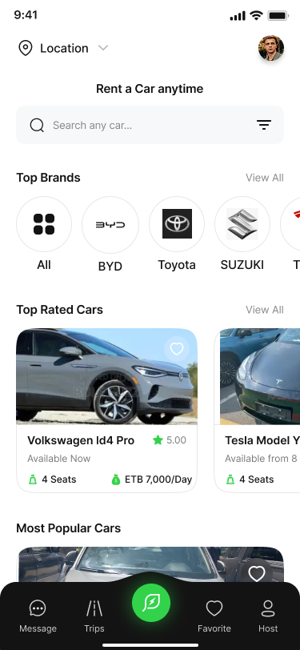
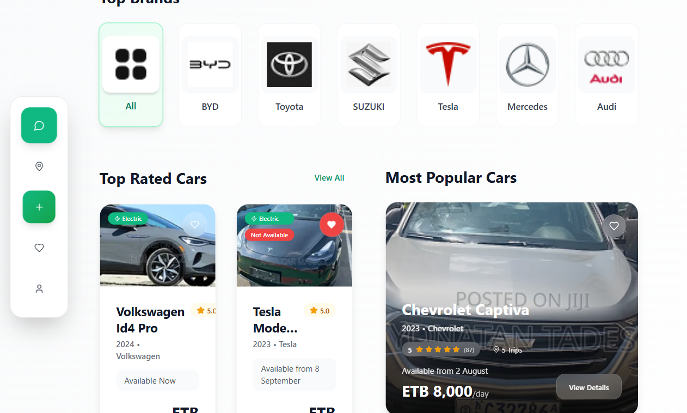

# 🚗 Car Rental App

<br>
<!--  -->
A modern, responsive car rental application built with React, TypeScript, and Vite. This app provides a seamless experience for users to browse, book, and rent vehicles with an integrated driver verification system.


## 🎨 Design

This project is based on the beautiful Figma design: [Car Rental App Design](https://www.figma.com/design/hrd7AT2RUCHQGMB7RpNe70/Project-Management?node-id=0-1&p=f&t=NFKL5I8CRflo3ddZ-0)

## ✨ Features

### 🏠 Core Functionality
- **Car Browsing**: Browse available cars with ratings, pricing, and availability
- **Advanced Search**: Filter cars by brand, type, and availability
- **Detailed Car Views**: Comprehensive car information with host details and reviews
- **Date Selection**: Interactive calendar for rental period selection
- **Location Selection**: Map-based pickup location selection with preset options
- **Real-time Pricing**: Dynamic pricing calculation with additional fees

### 💳 Payment System
- **Multiple Payment Methods**: Support for various Ethiopian payment gateways
  - TeleBirr
  - E-birr
  - CBE birr
  - Awash birr
  - Amole
  - Wegago
  - PayPal
  - Mastercard
  - Bank of Abyssinia (BOA)
- **Secure Checkout**: Comprehensive payment verification system

### 👤 Driver Verification
- **4-Step Verification Process**:
  1. **Profile Photo Upload**: Face verification for host recognition
  2. **Phone Number Verification**: SMS-based verification with OTP
  3. **License Upload**: Front and back license photo upload with auto-fill
  4. **Payment Confirmation**: Transaction verification and receipt

### 📱 User Experience
- **Responsive Design**: Optimized for mobile, tablet, and desktop
- **Progressive Form**: Step-by-step verification with progress tracking
- **Real-time Validation**: Immediate feedback and error handling
- **Smooth Animations**: Engaging transitions and micro-interactions

## 🛠 Technology Stack

- **Frontend Framework**: React 18
- **Language**: TypeScript
- **Build Tool**: Vite
- **Styling**: Tailwind CSS
- **Routing**: React Router DOM
- **State Management**: React Context API
- **Data Fetching**: TanStack React Query
- **UI Components**: Custom components with Shadcn/ui
- **Icons**: Lucide React
- **Notifications**: Sonner + React Hot Toast

## 📁 Project Structure

```
src/
├── components/
│   ├── ui/                 # Reusable UI components
│   ├── form/              # Form-specific components
│   │   ├── ProgressBar.tsx
│   │   ├── ProfileUpload.tsx
│   │   ├── PhoneNumberEntry.tsx
│   │   ├── OTPModal.tsx
│   │   ├── DrivingLicenseUpload.tsx
│   │   └── Verification.tsx
│   ├── Header.tsx
│   ├── SearchBar.tsx
│   ├── BrandCarousel.tsx
│   ├── TopRatedCars.tsx
│   ├── MostPopularCars.tsx
│   └── BottomNavigation.tsx
├── contexts/
│   └── BookingContext.tsx  # Global booking state management
├── data/
│   └── data.ts            # Mock data and utility functions
├── pages/
│   ├── Index.tsx          # Home page
│   ├── CarDetails.tsx     # Car details page
│   ├── SelectDate.tsx     # Date selection page
│   ├── SelectPickup.tsx   # Pickup location page
│   ├── Checkout.tsx       # Checkout summary page
│   ├── Payment.tsx        # Payment gateway page
│   ├── ApproveDriver.tsx  # Driver approval intro
│   └── DriverForm.tsx     # Multi-step driver verification
├── types/
│   └── index.ts          # TypeScript type definitions
└── App.tsx               # Main application component
```

## 🚀 Installation Guide

### Prerequisites

- **Node.js** (version 16.0.0 or higher)
- **npm** or **yarn** package manager
- **Git** for version control

### Step 1: Clone the Repository

```bash
git clone 
cd car-rental-app
```

### Step 2: Install Dependencies

Using npm:
```bash
npm install
```

Using yarn:
```bash
yarn install
```

### Step 3: Environment Setup

Create a `.env` file in the root directory:

```env
VITE_APP_TITLE=Car Rental App
VITE_API_BASE_URL=http://localhost:3000
VITE_GOOGLE_MAPS_API_KEY=your_google_maps_api_key
```

### Step 4: Start Development Server

Using npm:
```bash
npm run dev
```

Using yarn:
```bash
yarn dev
```

The application will be available at `http://localhost:5173`

### Step 5: Build for Production

Using npm:
```bash
npm run build
```

Using yarn:
```bash
yarn build
```

## 🎯 Usage

### For Users
1. **Browse Cars**: View available vehicles on the home page
2. **Select Car**: Click on any car to view detailed information
3. **Choose Dates**: Select your rental period using the calendar
4. **Pick Location**: Choose or enter your pickup location
5. **Review & Pay**: Complete checkout with your preferred payment method
6. **Verify Profile**: Complete driver verification for first-time users

### For Developers
1. **Data Management**: Car data is currently stored in `src/data/data.ts`
2. **State Management**: Booking state is managed via React Context
3. **Routing**: All routes are defined in `src/App.tsx`
4. **Styling**: Use Tailwind CSS classes for consistent styling
5. **Components**: Reusable components are in `src/components/`

## 📸 App Screenshots

### Home Page

*Browse available cars with search and filter options*

### Car Details

*Detailed car information with host details and reviews*

### Date Selection
 currency
- Local payment gateways (TeleBirr, E-birr, etc.)
- Ethiopian phone number format (+251)
- Local pickup locations in Addis Ababa

## 🤝 Contributing

1. Fork the repository
2. Create a feature branch (`git checkout -b feature/amazing-feature`)
3. Commit your changes (`git commit -m 'Add amazing feature'`)
4. Push to the branch (`git push origin feature/amazing-feature`)
5. Open a Pull Request

## 📄 License

This project is licensed under the MIT License - see the [LICENSE](LICENSE) file for details.

## 🙏 Acknowledgments

- Design inspiration from [Figma Car Rental Design](https://www.figma.com/design/hrd7AT2RUCHQGMB7RpNe70/Project-Management?node-id=0-1&p=f&t=NFKL5I8CRflo3ddZ-0)
- Icons by [Lucide](https://lucide.dev/)
- UI components inspired by [Shadcn/ui](https://ui.shadcn.com/)


